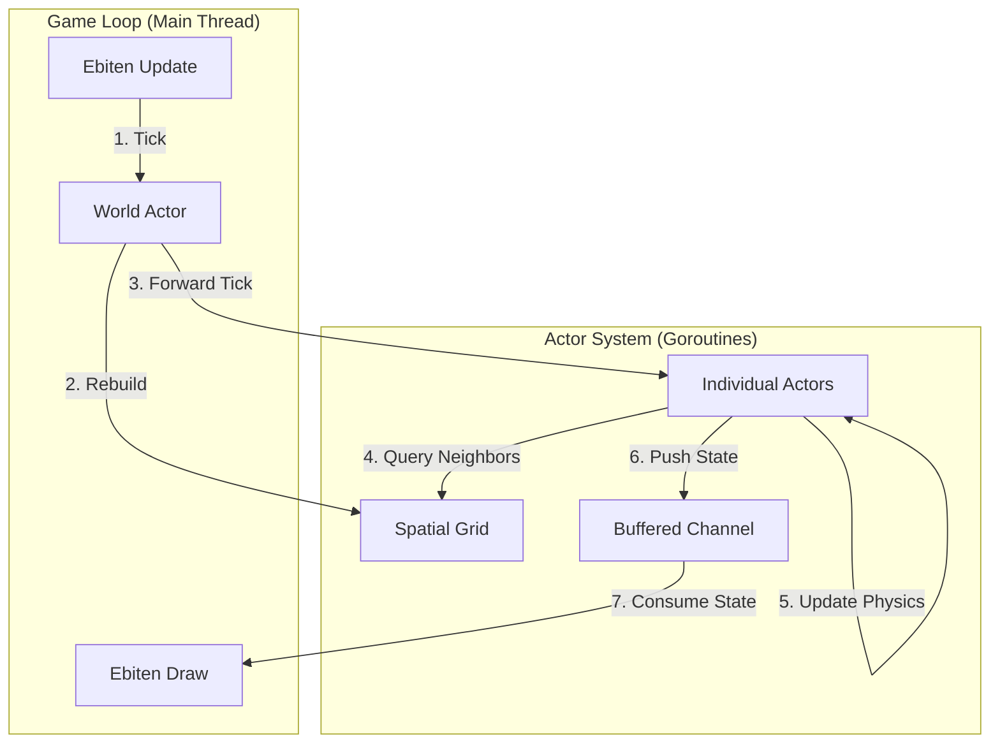

# 🐝 Go Swarm Simulation

> **A graphical experiment in decentralized decision-making using the Actor Model (GoAkt) and Ebitengine.**

## 🌟 Overview

**Go Swarm Simulation** is a "Game of Life on steroids" that demonstrates the power of the **Actor Model** for building concurrent, decentralized systems.

Instead of a central controller managing the state of every entity, each individual dot in this world is an autonomous **Actor** running in its own goroutine. They possess their own state, personality, and decision-making logic.

The simulation visualizes two distinct behaviors interacting in a 2D world:

* 🔴 **Red Swarm (Aggressive):** Fast-moving chasers that hunt down other actors.
* 🔵 **Blue Swarm (Consensual):** Flock together using **Boids** algorithms (Cohesion, Alignment, Separation).

## 🚀 Features

* **Actor Model Architecture:** Built on [GoAkt](https://github.com/Tochemey/goakt), utilizing Protocol Buffers for high-performance message passing.
* **Spatial Hashing:** Optimized neighbor lookups using a spatial grid, allowing for efficient O(1) interaction checks even with large populations.
* **Dynamic Behavior Switching:** Actors change their internal message handling logic at runtime using `ctx.Become()` (e.g., switching from "Aggressive" to "Flocking" upon conversion).
* **Flocking Behaviors:** Implementation of Reynolds' Boids algorithm for realistic group movement.
* **Real-Time Visualization:** Renders thousands of concurrent updates smoothly using [Ebitengine](https://ebitengine.org/).

## 🛠️ Architecture

The project follows a clean separation of concerns:

1.  **The World (Brain):** The `WorldActor` manages the authoritative state and the **Spatial Grid**. It handles collision detection and broadcasts updates.
2.  **The Individuals (Actors):** Each entity is an actor that decides how to move based on its current behavior (Red or Blue).
3.  **The Protocol (Protobuf):** All messages (`Tick`, `GetState`, `ActorState`) are strictly defined in `proto` files for type safety.
4.  **The View (Ebiten):** The main game loop simply drains the update channel and renders the latest known state.

### Data Flow Diagram



## 📦 Prerequisites

* **Go:** Version 1.22 or higher.
* **Protoc Compiler:** (Optional) Only needed if you modify the `.proto` definitions.

## 🏁 Getting Started

### 1. Clone the Repository

```bash
git clone https://github.com/your-username/go-swarm-simulation.git
cd go-swarm-simulation
```

### 2. Install Dependencies

```bash
go mod tidy
```

### 3. Run the Simulation

Launch the main actor-based simulation:

```bash
go run cmd/simulation/main.go
```

### 4. Run the Standalone Boids Demo

If you want to see the pure flocking algorithm in action (without the Actor Model overhead), run the lightweight boids demo:

```bash
go run cmd/boids/main.go
```

## 📂 Project Structure

```text
.
├── cmd/
│   ├── simulation/      # Main entry point (Ebiten Game Loop)
│   └── boids/           # Standalone Boids Algorithm Demo
├── pkg/
│   ├── simulation/      # Core Actor Logic (World, Individual)
│   └── behavior/        # Boids Flocking Logic
├── pb/                  # Protobuf definitions
├── scripts/             # Helper scripts
└── go.mod
```

## 🧠 How It Works (Code Snippet)

One of the most powerful features of the Actor Model is **Behavior Switching**. An actor can completely change how it handles messages at runtime.

In this simulation, when a Red actor is "converted" to Blue, it doesn't just change a flag—it hot-swaps its entire message processing function:

```go
// pkg/simulation/individual.go

func (i *Individual) RedBehavior(ctx *actor.ReceiveContext) {
    switch msg := ctx.Message().(type) {
    case *Convert:
        if msg.TargetColor == ColorBlue {
            // 1. Update State
            i.Color = ColorBlue
            
            // 2. Hot-swap Behavior
            // The actor now uses BlueBehavior for all future messages
            ctx.Become(i.BlueBehavior) 
            
            // 3. Reset Memory
            i.visibleTargets = nil
        }
    // ... handle other Red messages (Chasing) ...
    }
}

func (i *Individual) BlueBehavior(ctx *actor.ReceiveContext) {
    switch msg := ctx.Message().(type) {
    case *Tick:
        // Execute Flocking Logic (Boids)
        vx, vy := behavior.ComputeBoidUpdate(i, i.visibleFriends, i.cfg)
        i.vx = vx
        i.vy = vy
    // ... handle other Blue messages ...
    }
}
```

## 🤝 Contributing

Contributions are welcome! If you want to add new behaviors (e.g., "Green" actors that chase "Red" ones) or improve the rendering performance:

1.  Fork the Project
2.  Create your Feature Branch (`git checkout -b feature/AmazingFeature`)
3.  Commit your Changes (`git commit -m 'Add some AmazingFeature'`)
4.  Push to the Branch (`git push origin feature/AmazingFeature`)
5.  Open a Pull Request

## 📜 License

Distributed under the MIT License. See `LICENSE` for more information.

-----

*Built with ❤️ using [GoAkt](https://github.com/Tochemey/goakt) and [Ebitengine](https://ebitengine.org/)*