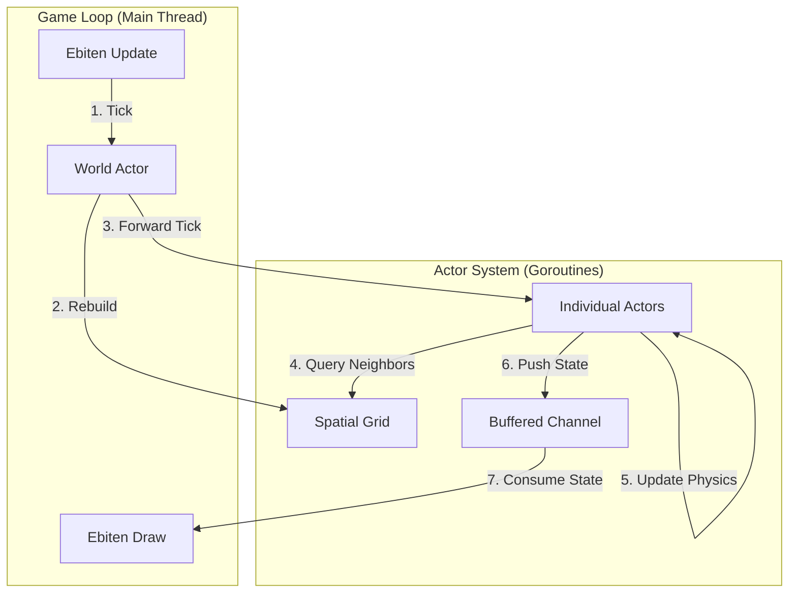

# 🐝 Go Swarm Simulation

> **Red Virus vs Blue Flock …Convert or Be Converted 🦠🚀**
> 

## 🌟 Overview

**Go Swarm Simulation** is a "Game of Life on steroids" that demonstrates the power of the **Actor Model** for building concurrent, decentralized systems.

*A graphical experiment in decentralized decision-making using the Actor Model (GoAkt) and Ebitengine.*

Instead of a central controller managing the state of every entity, each individual dot in this world is an autonomous **Actor** running in its own goroutine. They possess their own state, personality, and decision-making logic.
The simulation visualizes two distinct behaviors interacting in a 2D world.


# 


*(live demo – 25 red vs 250 blue boids tiny spaceships fighting for ideological supremacy)*

A real-time, visually polished swarm simulation in Go where **Red aggressive hunters** try to infect **Blue flocking prey**.  
One side uses raw pursuit and conversion, the other relies on classic Boids rules + safety-in-numbers.  
Watch emergent strategies appear: defensive circles, sacrifice plays, collapse waves, and total extinction events.

Pure Go • GoAkt actors • Ebitengine • Zero shared mutable state • Live-tunable parameters

## 🚀 Features

* **100 % Actor Model Architecture:** Built on [GoAkt](https://github.com/Tochemey/goakt), (no central "God object", no locks)
* **ProtoBuf**  Utilizing Protocol Buffers for high-performance message passing.
* **Spatial Hashing:** Optimized neighbor lookups using a spatial grid, allowing for efficient O(1) interaction checks even with large populations.
* **Dynamic Behavior Switching:** True hot behavior swapping via `ctx.Become()` – actors literally change personality-switch when converted.
* **Flocking Behaviors:** Implementation of Reynolds' Boids algorithm for realistic group movement.
* **Real-Time Visualization:** Renders thousands of concurrent updates smoothly using [Ebitengine](https://ebitengine.org/).
* Full live UI control panel (collapsible, animated, 20+ sliders & checkboxes)
- External `config.json` + JSON Schema validation
- Pre-rendered ASCII-art spaceships with glow trails (because why not
- Hot restart, profiling flags, clean shutdown
- Zero-allocation perception queries
- Ready for future GoAkt clustering (just flip a switch)

## 🛠️ Architecture

The project follows a clean separation of concerns:

1.  **The World (Brain):** The `WorldActor` manages the authoritative state and the **Spatial Grid**. It handles collision detection and broadcasts updates.
2.  **The Individuals (Actors):** Each entity is an actor that decides how to move based on its current behavior (Red or Blue).
3.  **The Protocol (Protobuf):** All messages (`Tick`, `GetState`, `ActorState`) are strictly defined in `proto` files for type safety.
4.  **The View (Ebiten):** The main game loop simply drains the update channel and renders the latest known state.

### Data Flow Diagram



## 📦 Prerequisites

* **Go:** Version 1.22 or higher.
* **Protoc Compiler:** (Optional) Only needed if you modify the `.proto` definitions.

## 🏁 Getting Started

### 1. Clone the Repository

```bash
git clone https://github.com/your-username/go-swarm-simulation.git
cd go-swarm-simulation
```

### 2. Install Dependencies

```bash
go mod tidy
```

### 3. Run the Simulation

Launch the main actor-based simulation:

```bash
go run cmd/simulation/main.go
```


## 📂 Project Structure

```text
.
├── cmd/
│   ├── simulation/      # Main entry point (Ebiten Game Loop)
├── pkg/
│   ├── simulation/      # Core Actor Logic (World, Individual)
│   ├── ui/              # Ui widgets for ebitten (buttons,sliders...)
│   └── geometry/        # Some helper for Vector handling
├── pb/                  # Protobuf definitions
├── scripts/             # Helper scripts
└── go.mod
```

## 🧠 How It Works (Code Snippet)

One of the most powerful features of the Actor Model is **Behavior Switching**. An actor can completely change how it handles messages at runtime.

In this simulation, when a Red actor is "converted" to Blue, it doesn't just change a flag—it hot-swaps its entire message processing function:

```go
// pkg/simulation/individual.go

func (i *Individual) RedBehavior(ctx *actor.ReceiveContext) {
    switch msg := ctx.Message().(type) {
    case *Convert:
        if msg.TargetColor == ColorBlue {
            // 1. Update State
            i.Color = ColorBlue
            
            // 2. Hot-swap Behavior
            // The actor now uses BlueBehavior for all future messages
            ctx.Become(i.BlueBehavior) 
            
            // 3. Reset Memory
            i.visibleTargets = nil
        }
    // ... handle other Red messages (Chasing) ...
    }
}

func (i *Individual) BlueBehavior(ctx *actor.ReceiveContext) {
    switch msg := ctx.Message().(type) {
    case *Tick:
        // Execute Flocking Logic (Boids)
        vx, vy := behavior.ComputeBoidUpdate(i, i.visibleFriends, i.cfg)
        i.vx = vx
        i.vy = vy
    // ... handle other Blue messages ...
    }
}
```


## Quick Start

```bash
git clone https://github.com/lao-tseu-is-alive/go-swarm-simulation.git
cd go-swarm-simulation

# First run – generates a sane default config.json + schema
go run .

# Or tweak everything live with the sliders
go run .

# CPU / memory profiling
go run . -cpuprofile cpu.pprof -memprofile mem.pprof
```

## Controls

- Move the mouse → interact with the left slide-in panel
- Click the `<` button top-right of panel hide/show it
- Change any slider apply new values and click **Restart** see the chaos unfold again
- All parameters are hot-reloaded on restart (no recompile needed)

## Tech Highlights

| Area                  | Implementation                                                                 |
|-----------------------|--------------------------------------------------------------------------------|
| Concurrency           | GoAkt v3 actors – each creature is an independent goroutine                       |
| Perception            | World pushes visible friends/targets every tick – no actor ever queries the world |
| Spatial partitioning   | Rebuilt grid every frame, zero-allocation radius queries                           |
| Rendering             | Ebitengine + pre-rendered 5×5 pixel spaceships from ASCII art + soft trails       |
| UI                    | Hand-rolled animated collapsible panel with sliders, checkboxes and sections      |
| Configuration          | `config.json` validated against `config_schema.json` – enterprise-grade            |

## Roadmap / Dreams

- [ ] GoAkt remoting → 50 k+ actors across multiple machines
- [ ] Headless replay server + GIF export
- [ ] WASM build (yes, it runs in the browser)
- [ ] Genetic evolution of parameters (watch new strategies evolve)
- [ ] Obstacles, resources, multiple factions

## Credits & Thanks

- GoAkt – https://github.com/tochemey/goakt
- Ebitengine – https://ebitengine.org
- Spaceship ASCII art stolen from my 12-year-old self’s notebook
- Window title proudly suggested by Grok 4.1

## 🤝 Contributing

PRs or any contributions are welcome!
 *· May your flock hold the line (or may it dramatically fail — both are fun).*

1.  Fork the Project
2.  Create your Feature Branch (`git checkout -b feature/AmazingFeature`)
3.  Commit your Changes (`git commit -m 'Add some AmazingFeature'`)
4.  Push to the Branch (`git push origin feature/AmazingFeature`)
5.  Open a Pull Request

## 📜 License

Distributed under the MIT License. See `LICENSE` for more information.

-----

*Built with ❤️ by Lao-Tseu-is-Alive in 2025 using [GoAkt](https://github.com/Tochemey/goakt) and [Ebitengine](https://ebitengine.org/)*
