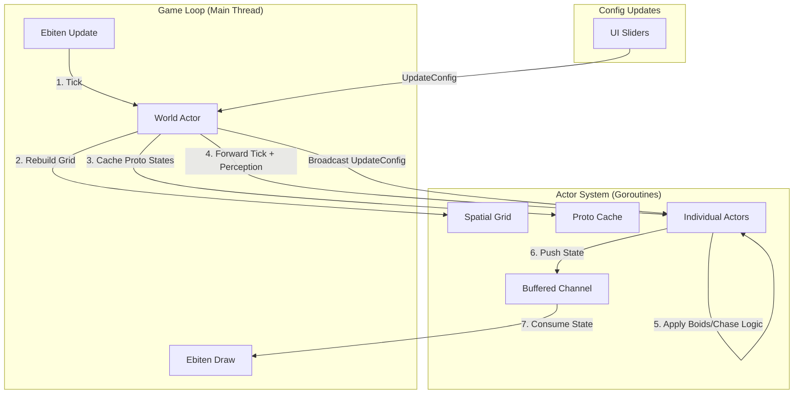

# 🐝 Go Swarm Simulation

> **🔴 Red Virus vs 🔵 Blue Flock …Convert or Be Converted 🦠🚀**

## 🌟 Overview

**Go Swarm Simulation** is a "Game of Life on steroids" that demonstrates the power of the **Actor Model** for building concurrent, decentralized systems.

*A graphical experiment in decentralized decision-making using the Actor Model (GoAkt) and Ebitengine.*

Instead of a central controller managing the state of every entity, each individual dot in this world is an autonomous **Actor** running in its own goroutine. They possess their own state, personality, and decision-making logic.
The simulation visualizes two distinct behaviors interacting in a 2D world.


*(live demo – 25 red vs 250 blue boids tiny spaceships fighting for ideological supremacy)*

A real-time, visually polished swarm simulation in Go where **Red aggressive hunters** try to infect **Blue flocking prey**.  
One side uses raw pursuit and conversion, the other relies on classic Boids rules + safety-in-numbers.  
Watch emergent strategies appear: defensive circles, sacrifice plays, collapse waves, and total extinction events.

Pure Go • GoAkt actors • Ebitengine • Zero shared mutable state • Live-tunable parameters

## 🚀 Features

* **100% Actor Model Architecture:** Built on [GoAkt](https://github.com/Tochemey/goakt) (no central "God object", no locks)
* **Thread-Safe Config:** Each actor owns its config values – no shared mutable state, updates via message passing
* **ProtoBuf Messages:** Utilizing Protocol Buffers for high-performance, type-safe message passing
* **Spatial Hashing:** Optimized neighbor lookups using a spatial grid, allowing for efficient O(1) interaction checks even with large populations
* **Proto State Caching:** Pre-computed protobuf states per tick reduce allocations by ~90%
* **Dynamic Behavior Switching:** True hot behavior swapping via `ctx.Become()` – actors literally change personality when converted
* **Flocking Behaviors:** Implementation of Reynolds' Boids algorithm for realistic group movement
* **Real-Time Visualization:** Renders thousands of concurrent updates smoothly using [Ebitengine](https://ebitengine.org/)
* **Full Live UI:** Collapsible control panel with 20+ sliders & checkboxes, color-coded by actor type
* **External Config:** `config.json` + JSON Schema validation with field names prefixed by actor color (e.g., `redDetectionRange`, `blueCohesion`)
* **Pre-rendered Sprites:** ASCII-art spaceships with glow trails
* **Hot Restart:** Change any parameter and click Restart – no recompile needed
* **Profiling Support:** CPU and memory profiling via command-line flags
* **Race Condition Fixes:** Defensive validation handles async message ordering edge cases

## 🛠️ Architecture

The project follows a clean separation of concerns:

1. **The World (Brain):** The `WorldActor` manages the authoritative state and the **Spatial Grid**. It handles collision detection and broadcasts updates to all Individual actors.
2. **The Individuals (Actors):** Each entity is an actor that owns its config values and decides how to move based on its current behavior (Red or Blue).
3. **The Protocol (Protobuf):** All messages (`Tick`, `GetState`, `ActorState`, `UpdateConfig`) are strictly defined in `proto` files for type safety.
4. **The View (Ebiten):** The main game loop simply drains the update channel and renders the latest known state.

### Data Flow Diagram


```mermaid
graph TD
    subgraph "Game Loop (Main Thread)"
        Update[Ebiten Update] -->|1. Tick| World[World Actor]
        Draw[Ebiten Draw]
    end

    subgraph "Actor System (Goroutines)"
        World -->|2. Rebuild Grid| Grid[Spatial Grid]
        World -->|3. Cache Proto States| Cache[Proto Cache]
        World -->|4. Forward Tick + Perception| Ind[Individual Actors]
        
        Ind -->|5. Apply Boids/Chase Logic| Ind
        Ind -->|6. Push State| Channel[Buffered Channel]
    end

    subgraph "Config Updates"
        UI[UI Sliders] -->|UpdateConfig| World
        World -->|Broadcast UpdateConfig| Ind
    end

    Channel -->|7. Consume State| Draw
```

## 📦 Prerequisites

* **Go:** Version 1.22 or higher
* **Protoc Compiler:** (Optional) Only needed if you modify the `.proto` definitions

## 🏁 Getting Started

### 1. Clone the Repository

```bash
git clone https://github.com/lao-tseu-is-alive/go-swarm-simulation.git
cd go-swarm-simulation
```

### 2. Install Dependencies

```bash
go mod tidy
```

### 3. Run the Simulation

```bash
go run ./cmd/simulation
```

### 4. Run with Profiling (Optional)

```bash
# CPU and memory profiling
go run ./cmd/simulation -cpuprofile cpu.pprof -memprofile mem.pprof

# Analyze with pprof
go tool pprof cpu.pprof
```

## 📂 Project Structure

```text
.
├── cmd/
│   └── simulation/      # Main entry point (Ebiten Game Loop)
├── pkg/
│   ├── simulation/      # Core Actor Logic (World, Individual, Config, Entity, Boids)
│   ├── ui/              # UI widgets for Ebiten (buttons, sliders, checkboxes)
│   ├── geometry/        # 2D Vector math library
│   └── version/         # Build version info
├── pb/                  # Protobuf definitions and generated code
├── config.json          # Runtime configuration (validated against schema)
├── config_schema.json   # JSON Schema for config validation
└── go.mod
```

## 🎮 Controls

| Action | Effect |
|--------|--------|
| **Click `< Settings`** | Show/hide the control panel |
| **Adjust sliders** | Change simulation parameters in real-time |
| **Click `Restart Simulation`** | Apply population changes and reset the world |

### Configuration Parameters

| Section | Parameters |
|---------|------------|
| **🔴 Red Hunter** | Detection Range, Attack Range, Aggression |
| **🔵 Blue Flock** | Flock Vision, Personal Space, Defense Range |
| **🔵 Flocking Tuning** | Cohesion, Separation, Alignment, Edge Avoidance |
| **Physics (Both)** | Max Speed, Min Speed |
| **Population** | Red Actors, Blue Actors (requires restart) |
| **Visualization** | Show Detection Circle, Show Defense Circle |

## 🧠 How It Works

### Behavior Switching

One of the most powerful features of the Actor Model is **Behavior Switching**. When a Red actor is "converted" to Blue, it hot-swaps its entire message processing function:

```go
// pkg/simulation/individual.go

func (i *Individual) handleConversion(ctx *actor.ReceiveContext, msg *pb.Convert) {
    oldColor := i.State.Color
    i.State.Color = msg.TargetColor

    // Hot-swap behavior function
    if i.State.Color == pb.TeamColor_TEAM_RED {
        ctx.Become(i.RedBehavior)
    } else {
        ctx.Become(i.BlueBehavior)
    }

    // Visual feedback: "Explosion" bounce effect
    i.State.Vel = i.State.Vel.Mul(-1.5)
}
```

### Thread-Safe Config

Each Individual actor owns its config values (no shared `*Config` pointer). Updates flow via messages:

```go
// World broadcasts config changes to all actors
case *pb.UpdateConfig:
    w.cfg.RedAggression = msg.GetAggression()
    // ... update world's copy
    
    // Broadcast to all individuals
    for _, pid := range w.pids {
        ctx.Tell(pid, msg)
    }

// Each Individual applies updates to its local copy
func (i *Individual) applyConfigUpdate(msg *pb.UpdateConfig) {
    i.redAggression = msg.GetAggression()
    i.blueCohesion = msg.GetCenteringFactor()
    // ...
}
```

## ⚡ Performance Optimizations

| Optimization | Description |
|--------------|-------------|
| **Spatial Hashing** | O(1) neighbor lookups instead of O(n²) |
| **Pre-squared Distances** | Avoid `sqrt()` in hot loops |
| **Proto State Caching** | Each entity's protobuf computed once per tick, reused for all perception queries |
| **Zero-allocation Filtering** | Slice re-slicing (`[:0]`) for race condition fixes |
| **Batched Sprite Rendering** | Pre-rendered spaceship images |

## 🗺️ Roadmap / Dreams

- [ ] GoAkt remoting → 50k+ actors across multiple machines
- [ ] Headless replay server + GIF export
- [ ] WASM build (yes, it runs in the browser)
- [ ] Genetic evolution of parameters (watch new strategies evolve)
- [ ] Obstacles, resources, multiple factions

## 🙏 Credits & Thanks

- **GoAkt** – https://github.com/tochemey/goakt
- **Ebitengine** – https://ebitengine.org
- **Zap Logger** – https://github.com/uber-go/zap
- Spaceship ASCII art stolen from my 12-year-old self's notebook
- Window title proudly suggested by Grok 4.1 🤣🔥

## 🤝 Contributing

PRs or any contributions are welcome!

*· May your flock hold the line (or may it dramatically fail — both are fun).*

1. Fork the Project
2. Create your Feature Branch (`git checkout -b feature/AmazingFeature`)
3. Commit your Changes (`git commit -m 'Add some AmazingFeature'`)
4. Push to the Branch (`git push origin feature/AmazingFeature`)
5. Open a Pull Request

## 📜 License

Distributed under the MIT License. See `LICENSE` for more information.

---

*Built with ❤️ by Lao-Tseu-is-Alive in 2025 using [GoAkt](https://github.com/Tochemey/goakt) and [Ebitengine](https://ebitengine.org/)*
